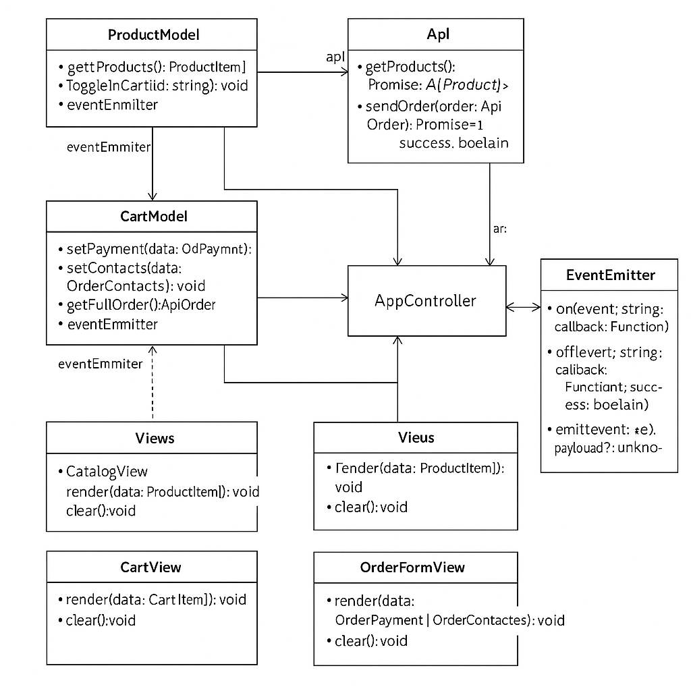

# Проектная работа "Веб-ларек"

Стек: HTML, SCSS, TS, Webpack

Структура проекта:
- src/ — исходные файлы проекта
- src/components/ — папка с JS компонентами
- src/components/base/ — папка с базовым кодом

Важные файлы:
- src/pages/index.html — HTML-файл главной страницы
- src/types/index.ts — файл с типами
- src/index.ts — точка входа приложения
- src/scss/styles.scss — корневой файл стилей
- src/utils/constants.ts — файл с константами
- src/utils/utils.ts — файл с утилитами

## Установка и запуск
Для установки и запуска проекта необходимо выполнить команды

```
npm install
npm run start
```

или

```
yarn
yarn start
```
## Сборка

```
npm run build
```

или

```
yarn build
```
🏗 Описание архитектуры

Проект построен по принципам MVP-архитектуры с использованием EventEmitter как брокера событий.

Основные сущности:

Основные сущности:
🔧 Базовые классы
EventEmitter — реализация шаблона "наблюдатель". Управляет подпиской и вызовом событий.

Api — клиент для взаимодействия с сервером. Выполняет запросы, возвращает данные.

📦 Модели:

ProductModel — управляет данными товара (получение, преобразование, фильтрация).

CartModel — управляет товарами в корзине.

OrderModel — управляет данными заказа (доставка, оплата, контакты).

👁 Представления (View):

CatalogView — отображает список товаров.

ModalView — отвечает за отображение модальных окон.

CartView — отображает содержимое корзины.

OrderFormView — форма оформления заказа (доставка, оплата, контакты).

🧠 Контроллеры:

AppController — связывает модель и представления, слушает события и управляет состоянием приложения.

🔄 Поток данных:

Данные приходят от Api.

ProductModel обрабатывает и сохраняет их.

AppController инициирует рендер каталога через CatalogView.

При действиях пользователя события отправляются в EventEmitter, контроллер слушает их и обновляет модель и представления.

📦 Типы данных:

Подробности смотрите в src/types/index.ts.

## UML-схема



🧾 src/types/index.ts

// Тип данных, приходящий с сервера
interface ApiProduct {
    id: string;
    title: string;
    category: string;
    description: string;
    image: string;
    price: number;
  }
  
  // Тип данных для отображения карточки товара
interface ProductItem {
    id: string;
    title: string;
    category: string;
    price: number;
    image: string;
    description: string;
    inCart: boolean;
  }
  
  // Тип данных в корзине
 interface CartItem {
    productId: string;
    title: string;
    price: number;
  }
  
  // Данные о заказе
  interface OrderPayment {
    address: string;
    paymentType: 'online' | 'cash';
  }
  
interface OrderContacts {
    email: string;
    phone: string;
  }
  
 interface ApiOrder {
    payment: OrderPayment;
    contacts: OrderContacts;
    items: string[]; // productId[]
  }
  
  // Интерфейс API клиента
  export interface IApiClient {
    getProducts(): Promise<ApiProduct[]>;
    sendOrder(order: ApiOrder): Promise<{ success: boolean }>;
  }
  
  // Интерфейс моделей
  export interface IProductModel {
    getProducts(): ProductItem[];
    toggleInCart(id: string): void;
  }
  
  export interface ICartModel {
    add(product: ProductItem): void;
    remove(productId: string): void;
    getItems(): CartItem[];
    clear(): void;
  }
  
  export interface IOrderModel {
    setPayment(data: OrderPayment): void;
    setContacts(data: OrderContacts): void;
    getFullOrder(): ApiOrder;
  }
  
  // Интерфейс отображения
  export interface IView<T> {
    render(data: T): void;
    clear(): void;
  }
  
  // Брокер событий
  export type AppEvent =
    | { type: 'product:add'; productId: string }
    | { type: 'product:remove'; productId: string }
    | { type: 'order:submit'; data: ApiOrder }
    | { type: 'modal:open'; productId: string }
    | { type: 'modal:close' };
  
  export interface IEventEmitter {
    on(event: string, callback: Function): void;
    off(event: string, callback: Function): void;
    emit(event: string, payload?: unknown): void;
  }
  
